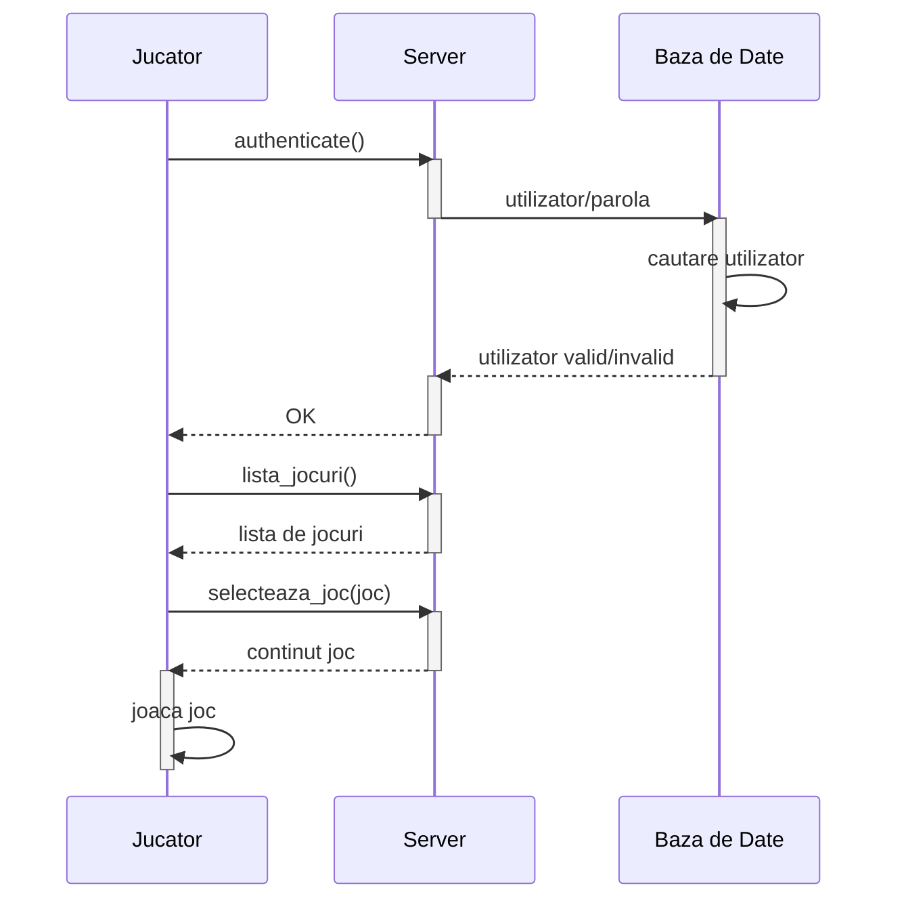
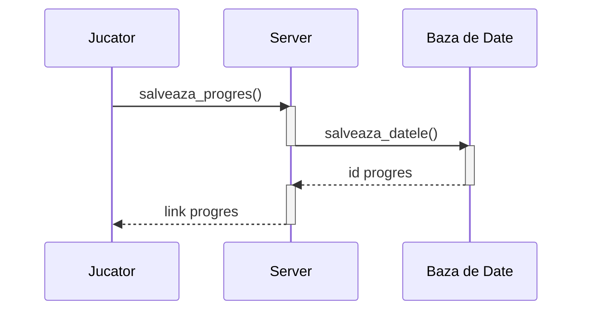
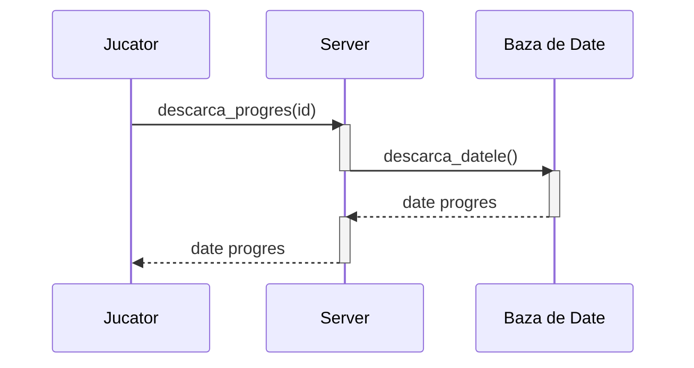
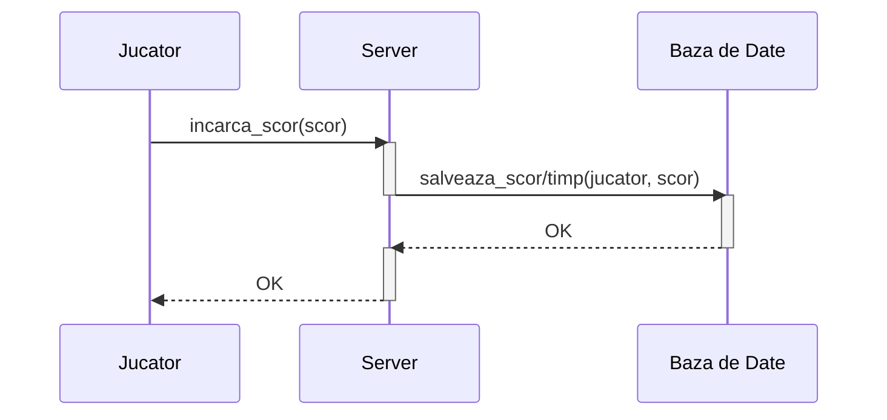
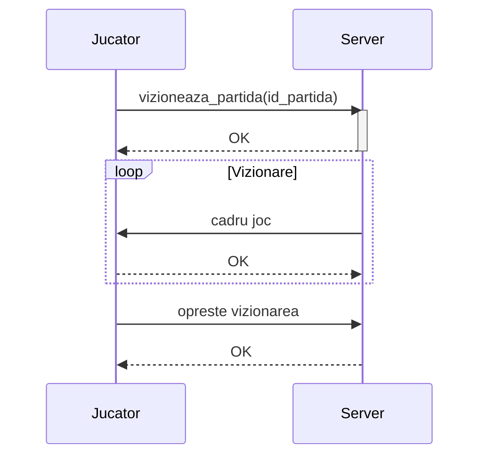
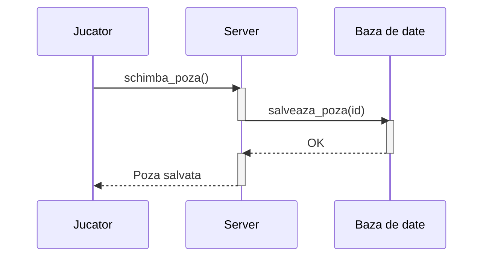

# Maxiclip (Platforma de Jocuri)
Bud Liviu-Alexandru
Fodor Rares-Alexandru
Theodor Tudose
Ciopa Cristian
# Introducere

## Scopul documentului
Scopul acestui document este de a prezenta modul de functionare si cerintele platformei on-line de jocuri cu mai multi jucatori 
**Maxiclip** intr-un mod cat mai concis si usor de inteles.

## Domeniul/Contextul de utilizare al sistemului
Domeniile aplicatiei dezvoltate sunt **web development** si **game development**. Utilizatorii pot sa opteze pentru
**Maxiclip** in contextul in care doresc sa aiba un spatiu prielnic pentru distractia impreuna cu cei dragi.

## Lista de definitii si abrevieri
* **Multiplayer**: cu mai multi jucatori.
* **DDOS**: Distributed Denial Of Service. Un atac cibernetic prin care se doreste coplesirea unui server cu trafic fictiv, astfel incat sa nu mai poata fi utilizat de utilizatorii sai.
* **Leaderboard**: tabela de scoruri, de obicei sortata descrescator
* **Rating**: recenzie
* **a hosta**: a rula un program care serveste continut utilizatorilor prin o retea
* **LAN**: Local Area Network. O retea de dimensiuni mici, de obicei la nivelul unei case/apartament.
* **Data Leak**: atac cibernetic prin care se doreste extragerea de informatii confidentiale dintr-o platforma.
* **Downtime**: timp in care serverul este disponibil clientilor
* **Pop-up**: fereastra de dimensiuni mici care contine un mesaj

# Descriere generala
## Scurta descriere a sistemului
**Maxiclip** este o platforma **web** de jocuri **multiplayer**, cu posibilitatea de a fi **hostata local**, care ofera 
utilizatorilor un spatiu de joaca foarte personalizabil, in care pot explora o multitudine de jocuri, pot comunica sau viziona jocurile altor jucatori in timp real, pot sa se lupte pentru a obtine cel mai bun scor sau timp, sau pot sa impartaseasca
experientele lor cu alti jucatori.

Utilizatorii isi vor creea un **profil**, unde acestia isi pot incarca o poza de profil, isi pot vedea pozitia de pe **leaderboard**,
dupa care pot sa isi aleaga un joc din portalul cu jocuri. Daca jocul este **single-player**, utilizatorul va avea putea sa isi 
salveze progresul, si chiar sa il impartaseasca cu prietenii, astfel incat cand acestia vor intra in joc, se vor afla in acelasi
loc ca si jucatorul original. Daca jocul este **multi-player**, utilizatorii pot sa vizioneze jocuri in curs de desfasurare, iar 
in cazul in care acestia intra in joc, scorul lor va fi salvat in **leaderboard**.

Daca utilizatorul doreste sa isi expuna opinia in legatura cu jocul sau cu experienta sa, acesta poate lasa un **rating** jocului
sau un comentariu.

## Motivatie
Membrii echipei **Maxiclip** au avut bucuria de a explora multitudinea de jocuri de pe platformele online ale copilariei, 
asa ca am dori sa aducem aceste experiente in vietile fiecarui om.

## Produse similare
In prezent exista mai multe platforme de jocuri online, cum ar fi **Miniclip**, **y8** sau **poki.com**, care ofera functionalitati
similare. Sistemul nostru ofera jocuri originale, si functionalitati de **sharing** care nu sunt prezente in platformele
competitorilor. Un alt plus al platformei noastre este faptul ca in cazul in care utilizatorul doreste sa **hosteze** local 
platforma, acesta nu are nevoie de conexiune la internet, lucru imposibil de realizat pe platformele competitorilor.

## Riscurile proiectului
In acest spatiu competitia este destul de acerba, cu competitori bine stabiliti in industrie, dar acesta este si un avantaj pentru
noi, deoarece putem sa aducem o viziune noua in acest spatiu.

Experienta noastra in domeniul programarii **web**, dar cu totii am petrecut mult timp jucandu-ne jocuri pe calculator, 
si avem viziunea necesara pentru a creea o platforma care sa fie pe placul tuturor.

Un alt risc asupra platformei ar fi atacurile cibernetice, de tip **Data Leak** sau de tip **DDOS**, care ar putea compromite
datele utilizatorilor sau ar putea cauza **downtime**.

# Sistemul propus
## Descrierea categoriilor de utilizatori ai sistemului
Platforma este destinata utilizatorilor mai tineri, sau familiilor care doresc sa petreaca timp impreuna, dar platforma poate
fi folosita de oricine doreste sa isi petreaca o mica parte din timpul liber jucand jocuri interactive si amuzante.

Categoriile de utilizatori:
* Jucator: utliziator care are este inregistrat pe platforma si poate folosi toate functionalitatile platformei, mai putin cele administrative
* Administrator: utilizator care este responsabil cu mentinerea ordinii in zonele unde utilizatorii pot sa posteze mesaje

## Cerinte de sistem
Cerintele de sistem depind de cazul de utilizare:

* utilizatorul dorese sa joace pe o platforma existenta
    - Conexiune la platforma (internet sau **LAN**)
    - Un browser updatat (**Firefox**/**Chrome**)
    - Un calculator cu minim 2 **GB RAM** si procesor **Dual-Core**
 
* utilizatorul doreste sa isi creeze propria platforma
    - Un calculator cu minim 4 **GB RAM** si procesor **Dual-Core**
    - NodeJS
    - **Firewall** cu porul platformei deschis
    - Placa de retea
    
    
## Cerinte functionale
Utilizatorul poate sa efectueze urmatoarele actiuni pe platforma:
* sa isi incarce o poza de profil
* poate sa salveze progresul jocurilor **Single-Player**
* poate sa isi trimita progresul salvat prietenilor
* poate sa vizioneze jocurile altor jucatori, in cazul in care acestea sunt **Multi-Player**
* poate sa lase recenzii si comentarii jocurilor
* poate sa descarce codul platformei si sa ruleze platforma pe propiul calculator, fara a fi nevoie de conexiune la internet
* poate sa se conecteze la platforme rulate in **LAN**

## Cerinte nefunctionale
* Trebuie sa ne asiguram ca respectam reglementarile **GDPR** deoarce dorim sa operam si in Uniunea Europeana.
* Exista unele limitari de continut, de exemplu in China nu este permis sa fie vizibile oase umane/scheleti, iar acest fapt necesita verificari asupra continutului jocurilor.
* Deoarece dorim ca codul sa fie distribuit, trebuie sa avem grija la licentele de software/de arta pe care le folosim
* In unele cazuri conexiunea la internet nu este destul de rapida pentru a oferi o experienta placuta, dar in acest caz se poate folosi optiunea de **self-hosting**

## Modele ale sistemului
### Actorii si cazurile de utilizare prin care interactioneaza

Actorii care participa la cazurile de utilizare sunt:
* Jucator 
* Spectator
* Admin

### Descrierea si cazurile de utilizare ale sistemului
#### Joc Single-Player
##### Actori:
* Jucator

##### Fluxul de baza:
* Jucatorul acceseaza platforma. Dupa ce isi introduce numele de utilizator si parola, acestuia ii este prezentat catalogul de jocuri. Jucatorul da click pe jocul **Single-Player** pe care doreste sa il joace, dupa care jocul incepe sa se incarce. Dupa ce jocul s-a terminat de incarcat, jucatorului ii este prezentat meniul principal al jocului. Acest meniu principal difera de la joc la joc, dar in general va exista o optiune care porneste efectiv jocul, optiune pe care jucatorul va da click. Jucatorul foloseste dispozitivele de intrare pentru a juca jocul.

##### Diagrama de secventa:

##### Alternative la fluxul de baza:
* Jucatorul introduce parola gresita, caz in care acesta va fi redirectionat din nou catre pagina de **Login**, unde va fi nevoit sa introduca din nou parola.
* Serverul nu este online, sau jucatorul nu poate sa se conecteze la server, caz in care browserul va arata o eroare.

##### Preconditii:
* Conexiune la server
* Serverul sa fie **ON-LINE**
* Jucatorul are un cont creeat si este logat

##### Postconditii:
* Jocul este deschis in browser

##### Prioritate la implementare
Prioritatea implementarii acestui caz de utilizare este una foarte mare, deoarece acest caz este principalul mod in care utilizatorii vor interactiona cu platforma, iar pe noi ca dezvoltatori ne va ajuta sa aducem platforma intr-un stagiu in care
putem sa implementam noi functionalitati.

#### Salvare joc
##### Actori:
* Jucator

##### Fluxul de baza:
* Jucatorul apasa be butonul **Save** al jocului pe care il joaca, dupa care este afisat un **pop-up** care informeaza jucatorul ca salvarea progresului a reusit si ofera un link prin care jucatorul poate sa distribuie mai departe progresul salvat cu alti jucatori.

##### Diagrama de secventa:

##### Alternative la fluxul de baza:
* Conexiunea catre server a fost pierduta, caz in care browserul va afisa o pagina de eroare

##### Preconditii:
* Jucatorul se afla intr-un joc **Single-Player**

##### Postconditii:
* In profilul jucatorului este salvat progresul din jocul curent, si este afisat un link prin care jucatorul poate distribui mai departe progresul salvat, cu alti jucatori

##### Prioritate la implementare
Prioritatea implementarii acestui caz este una medie, deoarece este un element diferentiator fata de platformele competitorilor.

#### Continuare progres
##### Actori:
* Jucator

##### Fluxul de baza:
* Jucatorul a primit un link de proges de la un alt jucator, acesta il introduce in platforma, ii este confirmat faptul ca progresul a fost adaugat in contul jucatorului.

##### Diagrama de secventa:

##### Alternative la fluxul de baza:
* Linkul este invalid, caz in care va fi afisat un mesaj de eroare care va informa jucatorul de acest fapt.

##### Preconditii:
* Jucatorul are un cont si este logat pe platforma.

##### Postconditii:
* In profilul jucatorului este adaugat progresul corespunzator link-ului, si este afisat un mesaj prin care jucatorul este informat de acest fapt.

##### Prioritate la implementare
Prioritatea implementarii acestui caz este una medie, deoarece este un element diferentiator fata de platformele competitorilor.orul este informat de acest fapt.

#### Continuare progres
##### Actori:
* Jucator

##### Fluxul de baza:
* Jucatorul a primit un link de proges de la un alt jucator, acesta il introduce in platforma, ii este confirmat faptul ca progresul a fost adaugat in contul jucatorului.

##### Diagrama de secventa:

##### Alternative la fluxul de baza:
* Linkul este invalid, caz in care va fi afisat un mesaj de eroare care va informa jucatorul de acest fapt.

##### Preconditii:
* Jucatorul are un cont si este logat pe platforma.

##### Postconditii:
* In profilul jucatorului este adaugat progresul corespunzator link-ului, si este afisat un mesaj prin care jucatorul este informat de acest fapt.

##### Prioritate la implementare
Prioritatea implementarii acestui caz este una medie, deoarece este un element diferentiator fata de platformele competitorilor.orul este informat de acest fapt.

#### Incarcare scor/timp
##### Actori:
* Jucator

##### Fluxul de baza:
* Dupa ce jucatorul a terminat un joc pentru care este disponibila incarcarea de scor-uri/timpi, un mesaj va fi afisat care il va intreba pe jucator daca doreste sa isi incarce scorul/timpul obtinut in baza de date, pentru a putea fi vizionat de alti jucatori. Daca jucatorul este de acord, acesta va apasa un buton de upload, dupa care va fi afisat un mesaj de confirmare ca operatia s-a efectuat cu succes.

##### Diagrama de secventa:

##### Alternative la fluxul de baza:
* In cazul in care utilizatorul nu doreste sa isi incarce scor-ul/timp-ul acesta va apasa pe butonul de **Reject**.
* In cazul in care s-a pierdut conexiunea la server, browser-ul va afisa o pagina de eroare.

##### Preconditii:
* Jucatorul a terminat o partida dintr-un joc care suporta incarcarea timpilor/scor-ului.

##### Postconditii:
* Scorul jucatorului a fost incarcat, si este vizibil de catre ceilalti jucatori in tabela de scoruri a jocului respectiv.

##### Prioritate la implementare
Prioritatea implementarii este mica spre medie, deoarece consideram ca este un feature destul de important pentru a creea interactiune si competitie intre jucatori, dar nu este critic.

#### Vizionarea de jocuri in derulare
##### Actori:
* Jucator

##### Fluxul de baza:
* Jucatorul selecteaza un joc care suporta vizionarea in derulare, dupa care i se afiseaza o lista cu jocurile care sunt in derulare in momentul de fata. Jucatorul selecteaza unul dintre jocurile in derulare, dupa care jocul este afisat in timp real pe ecran. Cand jucatorul nu mai doreste sa vizioneze jocul acesta apasa un buton care il va aduce inapoi la pagina cu jocuri.

##### Diagrama de secventa:

##### Alternative la fluxul de baza:
* Partida jucata s-a terminat inainte ca jucatorul sa apese butonul de oprire a vizionarii, caz in care acesta este redirectionat automat catre pagina cu jocuri.
* Conexiunea cu serverul este intrerupta in timpul vizionarii, va fi afisat un mesaj de eroare

##### Preconditii:
* Exista o partida in curs de derulare, jucatorul este logat pe platforma.

##### Postconditii:
* Jucatorul a vizionat partida in derulare in timp real.

##### Prioritate la implementare
Prioritatea implementarii este medie, deoarece aceasta functionalitate este importanta, dar nu critica pentru functionarea platformei. 

#### Modificare poza de profil
##### Actori:
* Jucator

##### Fluxul de baza:
* Jucatorul acceseaza pagina lui de profil, da click pe poza de profil, este afisata o fereastra in care jucatorul trebuie sa selecteze poza dorita. Dupa ce o selecteaza un mesaj de confirmare ca poza a fost schimbata este afisat.

##### Diagrama de secventa:

##### Alternative la fluxul de baza:
* Conexiunea cu serverul a jucatorului a fost pierduta, caz in care browserul va afisa un mesaj de eroare.

##### Preconditii:
* Jucatorul are un cont pe platforma si este logat.

##### Postconditii:
* Poza de profil a jucatorului a fost schimbata.

##### Prioritate la implementare
Prioritatea implementarii este mica, deoarece exista functionalitati mai importante, cum ar fi jocurile care trebuie implementate primele.

