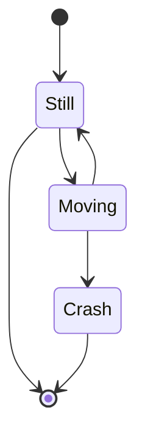

# Documentul de Proiectare Arhitecturala

# Introducere

## Scopul sistemului
Scopul acestui document este de a identifica partile care compun sistemul necersar pentru realizarea aplicatiei propuse, si a imparti aceste parti in componente mai mici care sunt mai usor de inteles si implementat. Astfem acest document ne va ajuta la distribuirea task-urilor in cadrul echipei, si realizarea unui program de sprint-uri in mod echilibrat din punct de vedere al orelor necesare.

## Definitii - Acronime
* SDK = Software Development Kit

## Documente - Referinte
[Documentul de specificare a cerintelor](https://gist.github.com/Potochi/33fe32cc650ce448618b1ef9d91c7d50)
[Documentatie "Appwrite"](https://appwrite.io/docs)
[Documentatie "React"](https://reactjs.org/docs/getting-started.html)

## Obiective de proiectare
* Alegerea unui framework de **backend** - Avand in vedere faptul ca echipa este formata din putini membrii (dar cu ambitii mari) am ales sa folosim un framework de **backend as a service** (BaaS) numit **Appwrite**. Acest framework ofera majoritatea functionalitatilor de care avem nevoie pentru a construi aplicatia, cum ar fi o **baza de date**, provideri pentru **login** si management de **sesiuni**. Framework-ul este **open-source**, ofera **SDK**-uri pentru multe limbaje de programare, si cel mai important feature, ofera posibilitatea de **self-hosting**, lucru de care avem nevoie deoarece **self-hosting**-ul platformei noastre este un factor diferentiator.
* Proiectarea unei arhitecturi scalabile si identificarea sistemelor si subsistemelor - pentru a oferi servicii unui numar cat mai mare de utilizatori posibili si dorim sa adaugam multe feature-uri, este necesara o arhitectura scalabila si extensibila. Din aceasta cauza subsistemele din cadrul aplicatiei trebuie sa fie cat mai slab cuplate posibil, pentru a nu crea dependinte pe care sa nu le putem inlocui mai tarziu daca este nevoie.
* Alegerea limbajului de programare - pentru acestui proiect am ales sa folosim **TypeScript**, deoarece este un limbaj foarte bine dezvoltat, cu un ecosistem mare de pachete **third-party** care ne pot ajuta sa ne indeplinim obiectiviele. Inca un plus este faptul ca Appwrite ofera SDK pentru TypeScrpt.
* Distribuirea taskurilor in mod egal si eficient - in cadrul acestui proiect scopul principal este sa ne dezvoltam abilitatile de dezvoltare software si sa ne largim orizonturile in legatura cu ce se poate realiza in domeniul IT. Acest fapt a fost luat in considerare in distribuirea task-urilor pe langa dorintele fiecaruia dintre noi. 

## Arhitectura propusa
### Prezentare generala a arhitecturii sistemului
* Web Layer
    * Interfata grafica - navigarea paginilor si vizualizarea functionalitatilor pentru utilizatorii de baza
    * Joc - Integrarea in pagina a jocului pe care utilizatorul doreste sa il joace
* Backend Layer
    * Game Service - serviciu care gestioneaza jocurile multiplayer in derulare
    * User Service (integrat in Appwrite) - serviciu care gestioneaza utilizatorul si functionalitatile pe care acesta le poate folosi
    * Admin Service (integrat in Appwrite) - serviciu care gestioneaza administratorii si functionalitatile pe care acestia le pot folosi

### Decompozitia in subsisteme si responsabilitatile fiecarui subsistem
* Interfata grafica - Interfata oferita de aplicatia web si mijlocul prin care utilizatorul interactioneaza cu aplicatia si serviciile. Aceasta cuprinde gestionarea conturilor utilizatorilor, precum si optiunile de **customizare**, cum ar fi adaugarea unei poze de profil, sau alte functionalitati cum ar fi lasarea de comentarii jocurilor disponibile pe platforma.
* Joc - Interfata jocurior disponibile pe platforma, aceasta va fi diferita de la joc la joc. Jocul mai trebuie sa poata comunica cu platforma pentru a oferi functionalitatile de **save-sharing** si **multiplayer**.
* Game Service - serviciul care se ocupa cu gestiunea jocurilor **multiplayer** si a spectatorilor. Acest serviciu va trebui sa simuleze starea jocului cu datele oferite de jucatori, dupa care sa distribuie aceasta stare catre toti jucatorii si spectatorii din jocul curent. Acest serviciu trebuie gestioneze mai multe jocuri deoadata fara sa incurce datele dintre ele. Acest serviciu va interactiona cu baza de date pentru a salva scor-uri sau alte statistici relevante din joc.
* Baza de Date - serviciul de stocare a datelor este oferit de Appwrite, care prin SDK pune la dispozitie un API usor de folosit pentru a interoga sau adaga date. In acest serviciu se vor stoca majoritatea datelor aplicatiei, cum ar fi comentariile, pozele de profil si multe altele.
* User/Admin Service - serviciul de management al utilizatorilor este din nou oferit de catre Appwrite, care permite prin intermediul API-ului sa se efectueze login-uri folosind **OAuth2** prin mai multi **provideri** cum ar fi Google sau Facebook, dar si login cu username si parola create pe platforma. Datorita faptului ca serviciile de gestionare a sesiunilor utilizatorilor sunt integrate, serviciul pentru administratori poate fi realizat foarte simplu dand permisiuni mai mari acestui tip de utilizator, si adaugand limitari la baza de date prin intermediul interfetei grafice.

## TODO DIAGRAMA

### Distributia subsistemelor pe platformele hardware/software
Subsistemele sunt distribuite pe 2 tipuri de device-uri. 
* Interfata web si interfata jocului sunt livrate de catre server browserului utilizatorului, care poate rula pe orice sistem de operare, chiar si mobile. Deoarece interfata grafica este scrisa in React, care vine transformat in Javascript, iar jocurile vor fi scrise in Typescript, care vine tot transformat in javascript, singurele fisiere care se ocupa de afisarea si functionalitatea interfetei grafice vor fi de tip HTML, Javascript si CSS.
* Tot ce tine de backend va rula in Appwrite pe unul din serverele noastre, sau in cazul in care utilizatorul doreste **self-hosting**, pe un calculator personal.

### Managementul bazei de date si al datelor persistente
In baza de date oferita de appwrite, tabelele din bazele de date clasice sunt inlocuite de **Colectii** iar randurile sunt inlocuite de **Documente**. Baza de date este de tipul **Document Store**, astfel pot fi stocate obiecte arbitrare de tipul JSON, fara a fi nevoie sa se respecte un format.

Totusi pentru a mentine o oarecare ordine, vom folosi schema urmatoare:
### TODO SCHEMA
### Controlul accesului si permisiunile tipurilor de utilizatori
In principal treaba administratorului este de a mentine civice discutiile, astfel permisiunile de care are nevoie extra sunt cele de a sterge comentarii. In rest acesta se bucura de aceleasi permisiuni ca si utilizatorii.

| Tip actiune         | Administrator | Utilizator |
|---------------------|:-------------:|:----------:|
| Adaugare comentarii | X             | X          |
| Stergere comentarii | X             |            |
| Jucare joc          | X             | X          |
| Modificare profil   | X             | X          |
| Progress Share      | X             | X          |
|                     |               |            |
### Fluxul global

### Conditii limita
* Oprirea serverului
    * Defectiuni hardware
        * Intreruperi ale functionarii serverului
        * Pana de curent
    * Defectiuni software
        * Implementare gresita a unor module 
        * Implementare gresita a functionalitatii in Appwrite
  * Atacuri cibernetice
      * Obtinerea datelor din baza de date
      * Coruperea bazei de date
      * Impiedicarea functionarii prin atacuri de tip **DDOS**
  * Schimbarea frameworkului de backend
### Planificarea implementarii
#### Sprint 1

| Nume                              | Asignat             | Estimare |
|-----------------------------------|---------------------|----------|
| Setup Typescript                  | Toata echipa        | 2h       |
| Setup React                       | Toata echipa        | 2h       |
| Setup Appwrite                    | Toata echipa        | 4h       |
| Configurare baza de date          | Toata echipa        | 4h       |
| Configurare permisiuni Appwrite   | Bud Liviu-Alexandru | 2h       |
| Componenta Login React            |                     |          |
| Componenta Lista Jocuri React     |                     |          |
| Componenta Lista Comentarii React |                     |          |
| Componenta Profil React           |                     |          |
